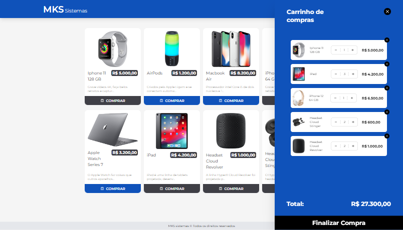

# :computer: MKS Sistemas

Este é o front-end do MKS Sistemas, uma pequena aplicação de e-commerce desenvolvida para o front-end challenge da companhia MKS Desenvolvimento de Sistemas e Empreendimentos Ltda.

## :credit_card: Features

- Adicionar os produtos desejados ao carrinho;
- Gerenciar seu carrinho:
   - Remover os produtos que não quiser mais;
   - Controlar a quantidade desejada de cada item;
   - Finalizar a compra (removerá todos os itens do carrinho).

## :hammer: Principais tecnologias (além de outras)

- Setup: **React.js** + **TypeScript** + **Vite**;
- Estilização com **Tailwind-Styled-Component**: styled-components + Tailwind CSS;
- Otimização de requisições com **Axios** e **React Query**;
- Gerenciamento de estados globais com **Zustand**;
- Transições suaves com **Framer Motion**.

## :blue_book: Requisitos

Você pode conferir os requisitos do desafio [aqui](https://github.com/star-soft/starsoft-frontend-challenge/tree/main).
